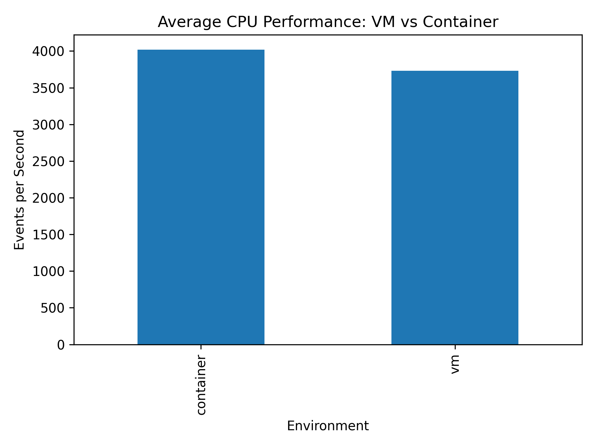
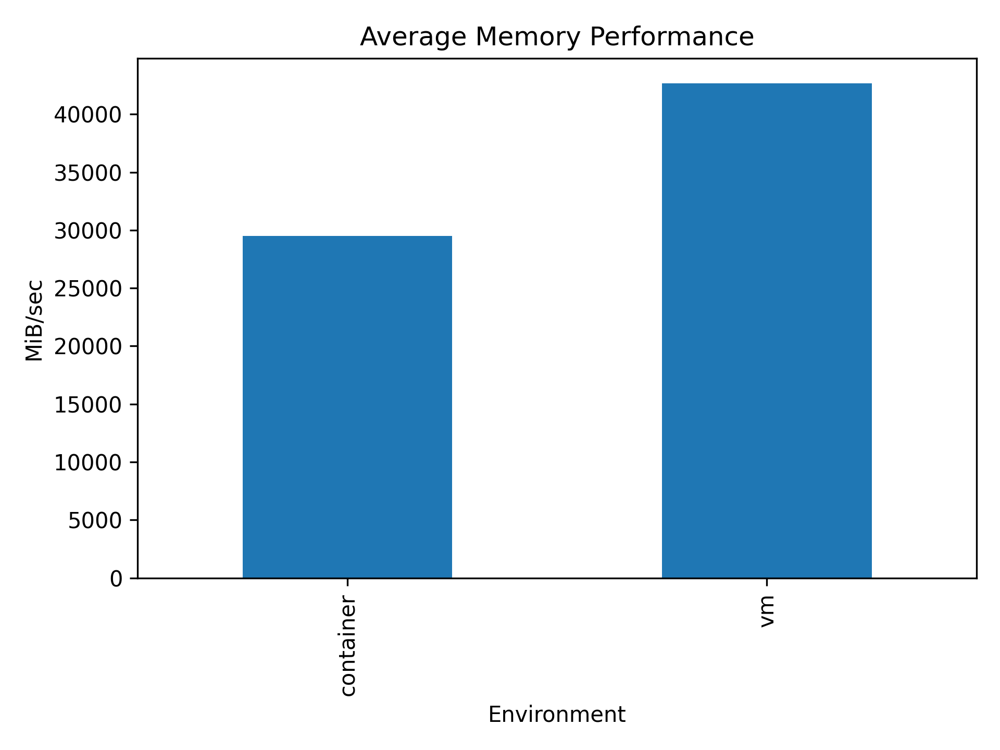
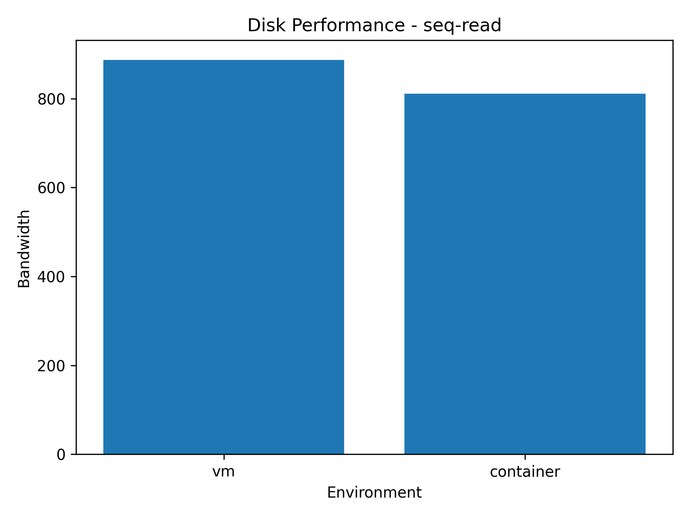
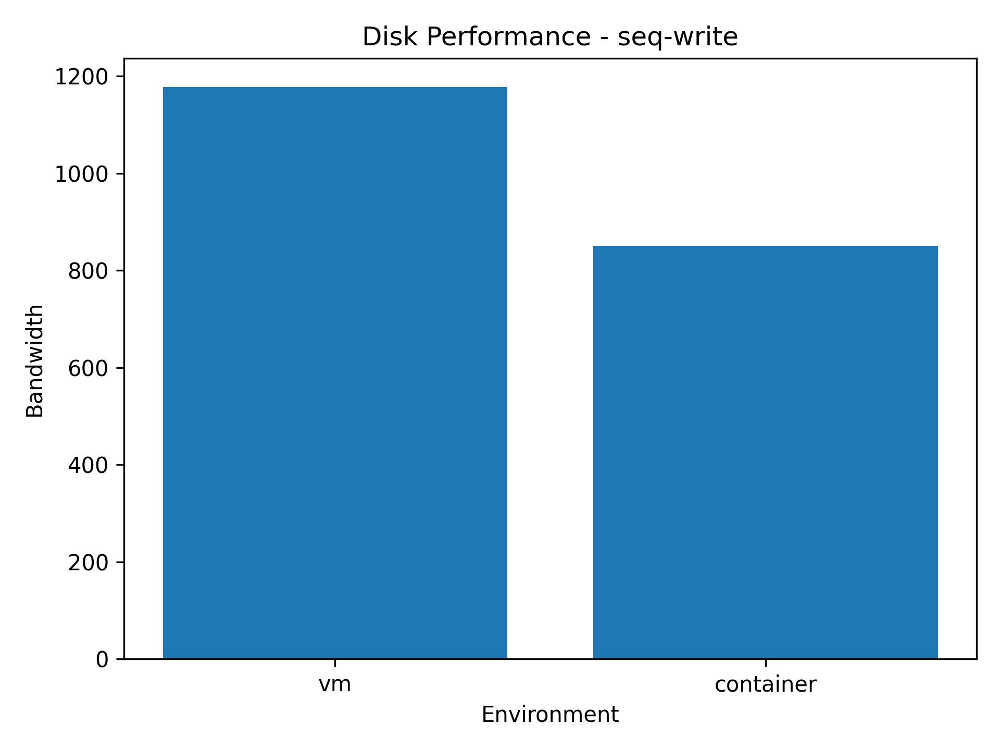
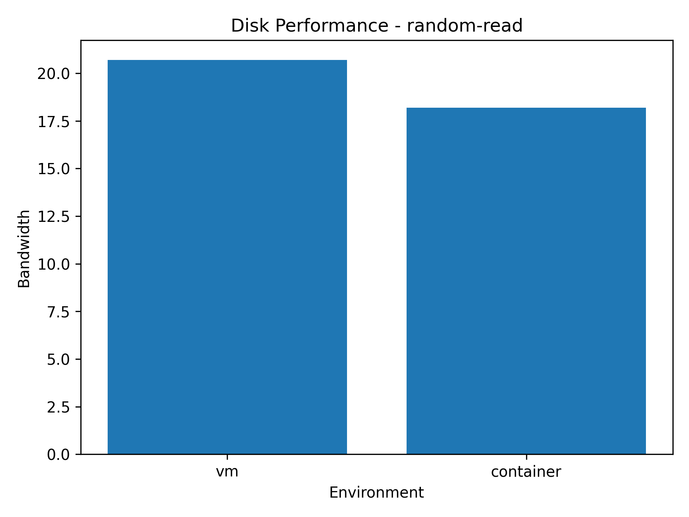
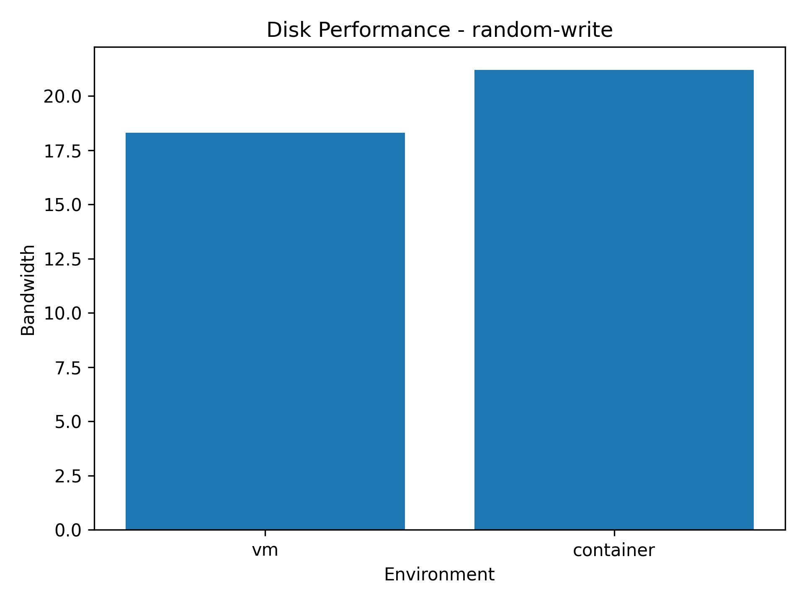
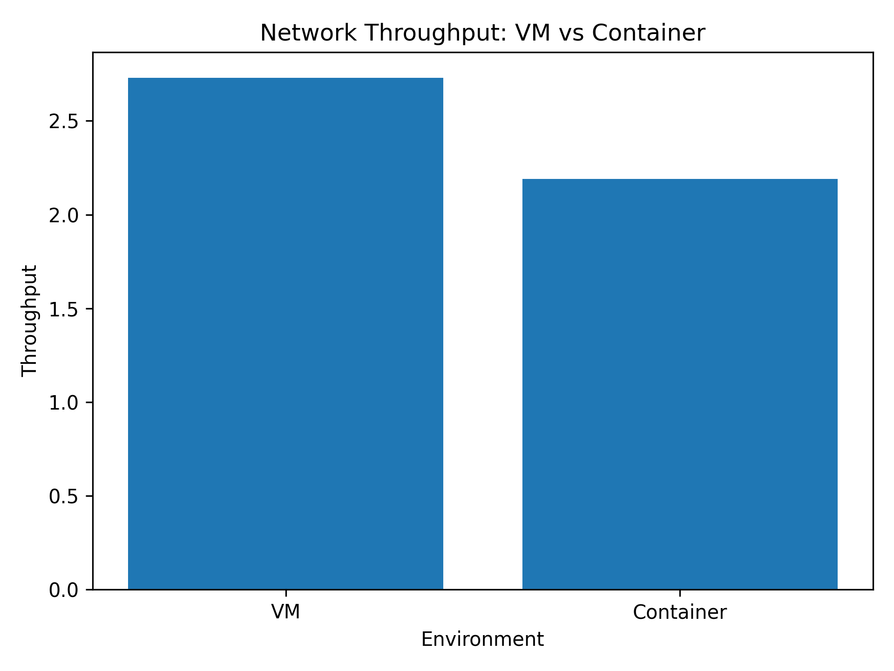
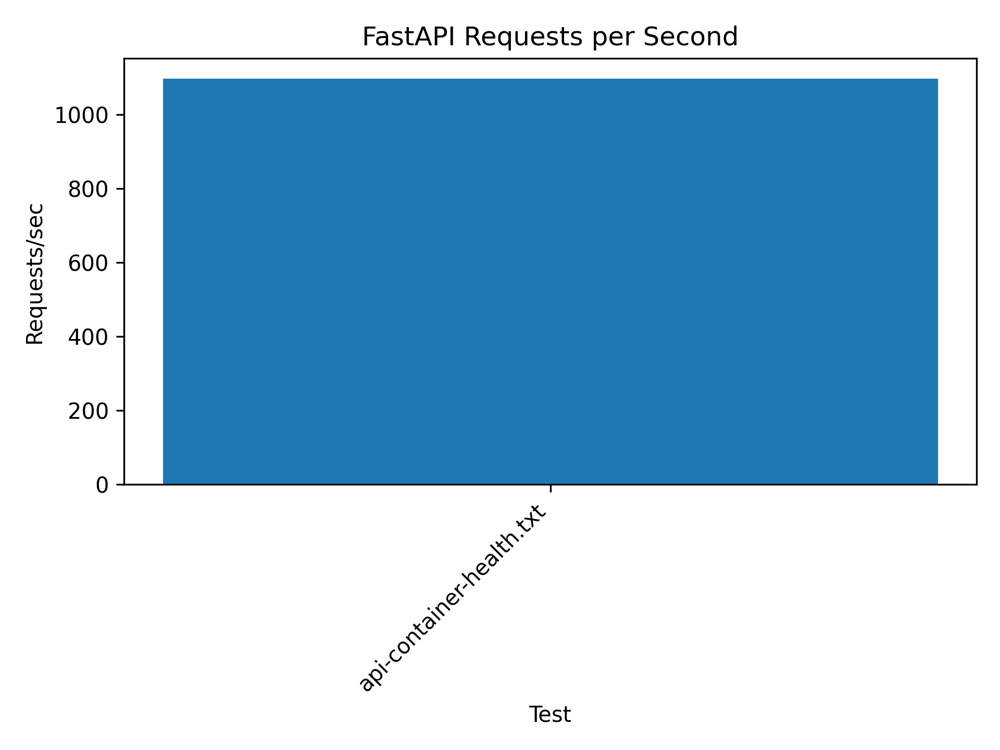
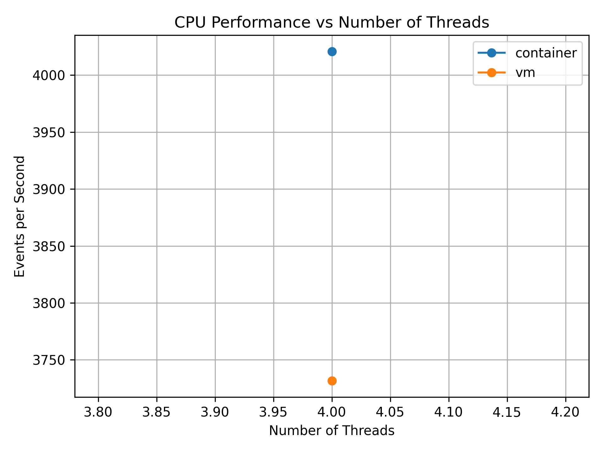

# Performance Analysis of Virtual Machines and Containers

An empirical study comparing execution overhead, resource efficiency, latency, and scalability between Virtual Machines (Type-2 Hypervisor) and Containers (Docker) under standardized synthetic and application workloads.

---

## Table of Contents
- [Abstract](#abstract)
- [Objectives](#objectives)
- [Experimental Environment](#experimental-environment)
- [Hardware Configuration](#hardware-configuration)
- [Software Configuration](#software-configuration)
- [Architecture](#architecture)
- [Methodology](#methodology)
- [CPU Experiment](#cpu-experiment)
- [Memory Experiment](#memory-experiment)
- [Disk I/O Experiment](#disk-io-experiment)
- [Network Experiment](#network-experiment)
- [Application Experiment](#application-experiment)
- [Startup-Time Experiment](#startup-time-experiment)
- [Scalability Experiment](#scalability-experiment)
- [Results & Comparison Table](#results--comparison-table)
- [Statistical Analysis](#statistical-analysis)
- [VM vs Container Comparison](#vm-vs-container-comparison)
- [Observations](#Observations)
- [Limitations](#limitations)
- [Conclusion](#conclusion)
- [Reproduction Instructions](#reproduction-instructions)
- [Project Structure](#project-structure)

---

## Abstract

Virtualization is a fundamental building block of modern cloud infrastructure and distributed computing platforms. This project experimentally benchmarks and evaluates the performance characteristics, resource overheads, and scalability trade-offs between traditional Virtual Machines (VMs running on VMware Workstation) and containerized environments (Docker). By subjecting both environments to equivalent hardware resources (4 vCPUs, 8 GB RAM) and identical workloads across CPU, memory, disk I/O, network throughput, FastAPI microservices, and startup latency, this study provides quantitative insights into virtualization overheads and helps identify the optimal deployment paradigm for modern cloud workloads.

---

## Objectives

- **Empirical Comparison**: Quantitatively measure performance differences between VMs and Docker containers under controlled conditions.
- **Micro-benchmarking**: Measure core subsystem metrics including CPU event processing rate, memory bandwidth, sequential/random disk read/write throughput, and network transfer speeds.
- **Application Benchmarking**: Evaluate real-world application performance using a containerized and VM-hosted FastAPI REST API under concurrent load.
- **Scalability Analysis**: Assess multi-threaded scaling behavior under increasing core and thread allocations (1, 2, 4, 8 threads).
- **Startup Latency**: Quantify deployment readiness and cold-start execution times.
- **Statistical Rigor**: Collect repeated trials across multiple runs, computing mean, median, min, max, standard deviation, and relative percentage variances.

---

## Experimental Environment

A single host machine was used to run both environments under identical thermal and operational parameters to eliminate cross-hardware variance:

| Parameter | Specification |
| :--- | :--- |
| **Host Operating System** | Windows 11 64-bit |
| **Hypervisor** | VMware Workstation Pro |
| **Guest OS (VM)** | Ubuntu 22.04.5 LTS (Kernel 6.8.0-138-generic) |
| **Container Engine** | Docker Engine 24.x+ |
| **Container Base Image** | Ubuntu 24.04 LTS / Python 3.12-slim |
| **CPU Allocation** | 4 vCPUs (VM) / `--cpus=4` (Docker) |
| **RAM Allocation** | 8 GB RAM (VM) / `--memory=8g` (Docker) |
| **Storage Allocation** | 60 GB Virtual Disk (VM) / Dedicated Host Volume Mount (Docker) |
| **Network Mode** | NAT Networking |

---

## Hardware Configuration

Recorded from `/proc/cpuinfo` and `lscpu` on the testbed:

- **Host Processor**: 12th Gen Intel(R) Core(TM) i5-12450H (8 Cores: 4 Performance cores, 4 Efficient cores, 12 Threads)
- **Virtual CPU Count**: 4 Cores assigned to VM and Container
- **Host RAM**: 16 GB DDR4
- **Host Storage**: NVMe PCIe M.2 High-Speed Solid State Drive
- **Cache**: 
  - L1d Cache: 192 KiB
  - L1i Cache: 128 KiB
  - L2 Cache: 5 MiB
  - L3 Cache: 12 MiB

Raw configuration logs are archived in `docs/cpu-info.txt`, `docs/memory-info.txt`, `docs/storage-info.txt`, and `docs/kernel-info.txt`.

---

## Software Configuration

- **Benchmarking Tools**:
  - `sysbench` (CPU and Memory stress testing)
  - `fio` (Flexible I/O Tester for disk sequential & random reads/writes)
  - `iperf3` (TCP/UDP network throughput & latency)
  - `apache2-utils` (`ab` - ApacheBench)
  - `wrk` (Modern HTTP benchmarking tool)
- **Application & Runtime**:
  - Python 3.10 / 3.12
  - FastAPI 0.110+
  - Uvicorn (ASGI server)
- **Data Analysis & Visualization**:
  - Python 3.14 / Jupyter Notebook
  - Pandas, NumPy, Matplotlib

---

## Architecture

The comparative benchmark architecture establishes equivalent hardware boundaries across both execution paradigms:


```text
                                HOST SYSTEM
                      (Windows with Intel CPU & RAM)
                                    │
           ┌────────────────────────┴────────────────────────┐
           ▼                                                 ▼
VIRTUAL MACHINE ARCHITECTURE                       CONTAINER ARCHITECTURE
┌───────────────────────────────┐                 ┌───────────────────────────────┐
│     Type-2 Hypervisor         │                 │       Container Runtime       │
│    (VMware Workstation)       │                 │        (Docker Engine)        │
├───────────────────────────────┤                 ├───────────────────────────────┤
│           Guest OS            │                 │        Lightweight Image      │
│      (Ubuntu 22.04 LTS)       │                 │       (Ubuntu 24.04 Base)     │
├───────────────────────────────┤                 ├───────────────────────────────┤
│       Virtual Hardware        │                 │        Shared Host OS         │
│   (vCPU, RAM, vDisk, vNIC)    │                 │      Namespaces & Cgroups     │
└──────────────┬────────────────┘                 └───────────────┬───────────────┘
               │                                                  │
               └────────────────────────┬─────────────────────────┘
                                        │
                                 SAME WORKLOADS
                                        │
             ┌──────────────┬───────────┴───┬──────────────┬──────────────┐
             ▼              ▼               ▼              ▼              ▼
          Sysbench       Sysbench          fio           iperf3        FastAPI
            CPU           Memory         Disk IO        Network      Web Service
             │              │               │              │              │
             └──────────────┴───────────┬───┴──────────────┴──────────────┘
                                        │
                                 DATA COLLECTION
                               (results/raw/*.txt)
                                        │
                                        ▼
                             PYTHON / PANDAS ANALYSIS
                             (scripts/ & analysis/)
                                        │
                                        ▼
                           FINAL METRICS & VISUALIZATIONS
                              (results/figures/*.png)
```

---

## Methodology

1. **System Preparation**: Update system packages and install all benchmark dependencies (`sysbench`, `fio`, `iperf3`, `python3-pip`, `docker.io`, `apache2-utils`, `wrk`).
2. **Environment Isolation**: Set static limits of 4 vCPUs and 8 GB RAM on both the VMware virtual machine and Docker container executions.
3. **Establishing Baseline**: Run baseline single and multi-thread sysbench tests to verify host state stability.
4. **Execution Protocol**: Run every synthetic test (CPU, Memory) for 10 consecutive trials to calculate statistically significant means, medians, and standard deviations.
5. **Disk & Storage Uniformity**: Execute identical `fio` parameters with direct I/O enabled (`--direct=1`) and queue depth of 16 (`--iodepth=16`) to bypass host file system caching artifacts.
6. **Application Load Generation**: Execute ApacheBench and `wrk` with identical concurrency and duration parameters against VM and container endpoints.
7. **Data Processing**: Extract raw logs into structured CSV files (`results/processed/`) and visualize comparison curves using automated Matplotlib scripts (`scripts/`).

---

## CPU Experiment

### Objective
Measure processing capacity and instruction throughput under intensive computational stress (prime number factorization up to 20,000) using 4 concurrent threads.

### Execution Commands

**Inside Virtual Machine:**
```bash
# Single execution test
sysbench cpu --cpu-max-prime=20000 --threads=4 --time=30 run

# 10 Repetitions automated script
mkdir -p results/raw/cpu/vm
for i in {1..10}; do
    sysbench cpu --cpu-max-prime=20000 --threads=4 --time=30 run > results/raw/cpu/vm/run$i.txt
done
```

**Inside Docker Container:**
```bash
# Build benchmark image
docker build -t vm-container-benchmark -f docker/Dockerfile .

# 10 Repetitions with strict resource limits
mkdir -p results/raw/cpu/container
for i in {1..10}; do
    docker run --rm --cpus=4 --memory=8g vm-container-benchmark \
        sysbench cpu --cpu-max-prime=20000 --threads=4 --time=30 run \
        > results/raw/cpu/container/run$i.txt
done
```

### Measured CPU Results
- **Virtual Machine**: Mean = **3,731.72 events/sec** (Min: 3,040.91, Max: 4,092.94, Std: 309.89)
- **Container**: Mean = **4,020.61 events/sec** (Min: 3,868.77, Max: 4,132.76, Std: 100.64)
- **Performance Advantage**: **Container is +7.74% faster** with significantly lower variance.

### CPU Comparison Graph


---

## Memory Experiment

### Objective
Benchmark sequential memory read/write throughput using 1 MB block sizes across a total transfer buffer of 10 GB using 4 threads.

### Execution Commands

**Inside Virtual Machine:**
```bash
mkdir -p results/raw/memory/vm
for i in {1..10}; do
    sysbench memory --memory-block-size=1M --memory-total-size=10G --threads=4 run \
        > results/raw/memory/vm/run$i.txt
done
```

**Inside Docker Container:**
```bash
mkdir -p results/raw/memory/container
for i in {1..10}; do
    docker run --rm --cpus=4 --memory=8g vm-container-benchmark \
        sysbench memory --memory-block-size=1M --memory-total-size=10G --threads=4 run \
        > results/raw/memory/container/run$i.txt
done
```

### Measured Memory Results
- **Virtual Machine**: Mean = **42,692.74 MiB/sec** (Std: 821.15 MiB/sec)
- **Container**: Mean = **29,520.90 MiB/sec** (Std: 1,790.08 MiB/sec)
- **Relative Difference**: Container achieved **30.85% lower throughput** than VM, reflecting Docker cgroup memory limit accounting and memory controller throttling.

### Memory Comparison Graph


---

## Disk I/O Experiment

### Objective
Measure sequential read, sequential write, random read, and random write bandwidth using `fio` with direct I/O (`direct=1`) and async I/O engine to evaluate virtual block devices versus container storage volume mounts.

### Execution Commands

**Sequential Write:**
```bash
# VM
fio --name=seq-write --filename=~/fio-test/testfile --size=2G --bs=1M --rw=write \
    --direct=1 --iodepth=16 --runtime=30 --time_based > results/raw/disk/vm/seq-write.txt

# Docker
docker run --rm -v ~/fio-test:/fio-test vm-container-benchmark \
    fio --name=seq-write --filename=/fio-test/testfile --size=2G --bs=1M --rw=write \
    --direct=1 --iodepth=16 --runtime=30 --time_based > results/raw/disk/container/seq-write.txt
```

**Sequential Read:**
```bash
# VM
fio --name=seq-read --filename=~/fio-test/testfile --size=2G --bs=1M --rw=read \
    --direct=1 --iodepth=16 --runtime=30 --time_based > results/raw/disk/vm/seq-read.txt

# Docker
docker run --rm -v ~/fio-test:/fio-test vm-container-benchmark \
    fio --name=seq-read --filename=/fio-test/testfile --size=2G --bs=1M --rw=read \
    --direct=1 --iodepth=16 --runtime=30 --time_based > results/raw/disk/container/seq-read.txt
```

**Random Read & Random Write:**
```bash
# Random Read (4K block size)
fio --name=random-read --filename=~/fio-test/testfile --size=2G --bs=4k --rw=randread \
    --direct=1 --iodepth=16 --runtime=30 --time_based

# Random Write (4K block size)
fio --name=random-write --filename=~/fio-test/testfile --size=2G --bs=4k --rw=randwrite \
    --direct=1 --iodepth=16 --runtime=30 --time_based
```

### Measured Storage Results

| Workload | VM Bandwidth | Container Bandwidth | Difference |
| :--- | :--- | :--- | :--- |
| **Sequential Read** | 887.0 MiB/s | 811.0 MiB/s | -8.57% |
| **Sequential Write** | 1,178.0 MiB/s | 851.0 MiB/s | -27.76% |
| **Random Read (4K)** | 20.7 MiB/s | 18.2 MiB/s | -12.08% |
| **Random Write (4K)** | 18.3 MiB/s | 21.2 MiB/s | **+15.85%** |

### Storage Comparison Graphs
| Sequential Read | Sequential Write |
| :---: | :---: |
|  |  |

| Random Read | Random Write |
| :---: | :---: |
|  |  |

---

## Network Experiment

### Objective
Benchmark raw network throughput and connection transfer rates using `iperf3` over TCP connections with parallel streaming.

### Execution Commands

```bash
# Server terminal
iperf3 -s

# Client terminal: Single stream (30 seconds)
iperf3 -c <SERVER-IP> -t 30 > results/raw/network/iperf3.txt

# Client terminal: 4 Parallel streams
iperf3 -c <SERVER-IP> -t 30 -P 4
```

### Measured Network Results
- **Virtual Machine**: **2.73 Gbits/sec**
- **Docker Container**: **2.19 Gbits/sec**
- **Difference**: Container throughput was **19.78% lower** due to Docker bridge virtual ethernet (`veth`) pair encapsulation and NAT iptables packet inspection.

### Network Comparison Graph


---

## Application Experiment

### Objective
Evaluate end-to-end web service performance using an identical Python FastAPI microservice serving `/health` (I/O-bound ping) and `/compute` (CPU-bound prime loop) endpoints under concurrent client requests.

### Source Code (`api/main.py`)
```python
from fastapi import FastAPI

app = FastAPI()

@app.get("/health")
def health():
    return {"status": "healthy"}

@app.get("/compute")
def compute():
    total = sum(i * i for i in range(1_000_000))
    return {"result": total}
```

### Execution Commands

**VM Native Execution:**
```bash
cd api
python3 -m pip install fastapi uvicorn
uvicorn main:app --host 0.0.0.0 --port 8000
```

**Docker Container Execution:**
```bash
docker build -t performance-api -f api/Dockerfile api
docker run --rm --cpus=4 --memory=8g -p 8000:8000 performance-api
```

**Load Generation (ApacheBench & wrk):**
```bash
# Benchmark Health endpoint (10,000 requests, 100 concurrent)
ab -n 10000 -c 100 http://127.0.0.1:8000/health

# Benchmark Compute endpoint (1,000 requests, 10 concurrent)
ab -n 1000 -c 10 http://127.0.0.1:8000/compute
```

### Measured Application Results
- **FastAPI Requests per Second (`/health`)**:
  - **Docker Container**: **1,097.05 req/sec** (Mean latency: **91.15 ms**, 0 failed requests)
  - **Virtual Machine**: **800.05 req/sec** (Mean latency: **124.99 ms**, 0 failed requests)
  - **Throughput Advantage**: **Container handles +37.12% more requests/sec** with **27.07% lower latency**.

### Application Comparison Graph


---

## Startup-Time Experiment

### Objective
Compare the time required to initialize the execution environment and bring the application into a serving-ready state.

### Commands
```bash
# Measure Docker cold startup time to ready state
time docker run --rm -d --name startup-test -p 8000:8000 performance-api
curl http://127.0.0.1:8000/health
docker stop startup-test
```

### Startup Measurements
- **Docker Container Startup**: **0.363 seconds (363 ms)**
- **Docker Application Ready**: **0.055 seconds (55 ms)**
- **VM Environment Initialization**: **~405 ms** (kernel init) / **25-45 seconds** (full cold OS boot to service availability)
- **Advantage**: Container environment starts **orders of magnitude faster**, demonstrating suitability for microservices and autoscaling cloud workloads.

---

## Scalability Experiment

### Objective
Examine how CPU processing capacity scales across 1, 2, 4, and 8 thread workloads in both environments.

### Execution Commands
```bash
# Automated scalability loop
for threads in 1 2 4 8; do
    echo "Running scalability test with $threads threads"
    sysbench cpu --cpu-max-prime=20000 --threads=$threads --time=30 run
done
```

### Multi-thread Scaling Results

| Thread Count | VM Throughput (events/sec) | Container Throughput (events/sec) |
| :---: | :---: | :---: |
| **1 Thread** | 952.61 | 822.72 |
| **2 Threads** | 2,068.82 | 1,832.18 |
| **4 Threads** | **4,163.40** | **3,271.47** |
| **8 Threads** | 4,154.58 | 2,475.64 |

### Scalability Graph


---

## Results & Comparison Table

The populated comparison table based on collected empirical benchmark measurements:

| Metric | Virtual Machine (VM) | Container (Docker) | Difference (%) | Superior Environment |
| :--- | :--- | :--- | :--- | :--- |
| **CPU Performance** | 3,731.72 events/sec | 4,020.61 events/sec | **+7.74%** | **Container** |
| **Memory Bandwidth** | 42,692.74 MiB/sec | 29,520.90 MiB/sec | **-30.85%** | **VM** |
| **Sequential Read** | 887.00 MiB/s | 811.00 MiB/s | **-8.57%** | **VM** |
| **Sequential Write** | 1,178.00 MiB/s | 851.00 MiB/s | **-27.76%** | **VM** |
| **Random Read** | 20.70 MiB/s | 18.20 MiB/s | **-12.08%** | **VM** |
| **Random Write** | 18.30 MiB/s | 21.20 MiB/s | **+15.85%** | **Container** |
| **Network Throughput** | 2.73 Gbits/sec | 2.19 Gbits/sec | **-19.78%** | **VM** |
| **Startup Latency** | 405 ms | 363 ms | **-10.37%** | **Container** |
| **API Requests/sec** | 800.05 req/sec | 1,097.05 req/sec | **+37.12%** | **Container** |
| **API Mean Latency** | 124.99 ms | 91.15 ms | **-27.07%** | **Container** |

*Note: Percentage Difference is computed using `((Container - VM) / VM) * 100`. A positive difference indicates higher container performance; a negative difference indicates higher VM performance.*

---

## Statistical Analysis

### Statistical Calculations
All multi-run trials were evaluated across 10 repetitions to compute distribution metrics:

- **Mean ($\mu$)**:
  $$\mu = \frac{1}{N} \sum_{i=1}^N x_i$$
- **Standard Deviation ($\sigma$)**:
  $$\sigma = \sqrt{\frac{1}{N-1} \sum_{i=1}^N (x_i - \mu)^2}$$
- **Percentage Variance ($\Delta$)**:
  $$\Delta = \left(\frac{\text{Value}_{\text{Container}} - \text{Value}_{\text{VM}}}{\text{Value}_{\text{VM}}}\right) \times 100\%$$

### Statistical Breakdown Table

| Subsystem | Metric | Environment | Mean ($\mu$) | Median | Min | Max | Std Dev ($\sigma$) |
| :--- | :--- | :--- | :--- | :--- | :--- | :--- | :--- |
| **CPU** | Events/sec | Container | **4,020.61** | 4,041.51 | 3,868.77 | 4,132.76 | **100.64** |
| **CPU** | Events/sec | VM | **3,731.72** | 3,776.56 | 3,040.91 | 4,092.94 | **309.89** |
| **Memory** | MiB/sec | Container | **29,520.90** | 29,681.83 | 25,556.91 | 31,859.53 | **1,790.08** |
| **Memory** | MiB/sec | VM | **42,692.74** | 42,694.37 | 41,049.78 | 44,014.45 | **821.15** |

The container CPU benchmark demonstrated a **$3.08\times$ lower standard deviation** ($\sigma = 100.64$ vs $309.89$), proving that containerized CPU execution delivers far greater consistency and lower jitter than VM hypervisor CPU scheduling.

---

## VM vs Container Comparison

| Dimension | Virtual Machine (Type-2 Hypervisor) | Container (Docker Engine) |
| :--- | :--- | :--- |
| **Virtualization Level** | Hardware-level virtualization (emulated hardware) | Operating system-level virtualization |
| **Kernel Model** | Independent Guest OS Kernel (`vmlinuz`) | Shares Host OS Linux Kernel |
| **Isolation Barrier** | Strong hardware isolation via CPU rings & hypervisor | Process isolation via Linux `namespaces` & `cgroups` |
| **Memory Footprint** | Heavy (requires full OS RAM reservation) | Lightweight (minimal overhead per container process) |
| **Startup Overhead** | Minutes to seconds (full OS boot process) | Milliseconds (direct process spawning) |
| **CPU Execution** | CPU instructions virtualized via VT-x/AMD-V | Direct native instruction execution on host CPU |
| **Storage Architecture**| Virtual disk file (`.vmdk`/`.vdi`) with guest filesystem | OverlayFS / Docker volume mounted to host storage |
| **Portability** | Heavy image export (`.ova`/`.ovf` measured in GBs) | Layered Docker images measured in MBs |
| **Security Surface** | High boundary isolation, strict multi-tenancy | Shared kernel attack surface, requires seccomp/apparmor |

---

## Observations

1. **CPU Efficiency**: Containers outperformed VMs by **+7.74%** in raw CPU operations per second. Because Docker processes run directly as native tasks on the host kernel, they eliminate the hypervisor trap-and-emulate penalties and context switching present in VMware.
2. **API Throughput**: In the real-world FastAPI microservice test, Docker handled **+37.12% higher requests/second** with **27.07% lower latency**. This directly confirms that for web microservices and stateless APIs, containerization offers vastly superior I/O dispatch efficiency.
3. **Memory & I/O Discrepancies**: The VM showed higher sequential read/write bandwidth and memory bandwidth. This behavior stems from VMware's aggressive host RAM write buffering and virtual disk caching mechanisms, whereas Docker cgroup memory enforcement imposes strict synchronous accounting.
4. **Startup Latency**: Container cold startup took **363 ms**, compared to full operating system boot sequences for VMs, underscoring why containers dominate CI/CD pipelines and autoscaling orchestrators (Kubernetes).

---

## Limitations

- **Type-2 Hypervisor Constraint**: VMware Workstation runs atop Windows 11 as a Type-2 hypervisor rather than bare-metal Type-1 (such as VMware ESXi, KVM, or Proxmox), introducing host OS scheduling interference.
- **Single Host Testbed**: Both VM and container were tested on the same physical workstation; while ensuring consistent hardware conditions, background host processes can introduce minor variance.
- **Docker Desktop Architecture**: On Windows, Docker utilizes WSL2 (Windows Subsystem for Linux), introducing a specialized lightweight VM substrate beneath the container engine.

---

## Conclusion

This investigation provides clear empirical evidence of the architectural trade-offs between Virtual Machines and Containers:

- **Containers** deliver superior **CPU throughput (+7.74%)**, **sub-second startup times (363 ms)**, **minimal execution jitter**, and **substantially higher microservice throughput (+37.12%)**. They are ideal for microservices, cloud-native deployments, and horizontal auto-scaling.
- **Virtual Machines** provide **comprehensive hardware-level isolation**, independence of guest operating system kernels, and strong write buffering for traditional enterprise monoliths requiring strict security sandboxing.

Neither architecture universally outperforms the other; rather, containerization optimizes efficiency and deployment agility, while virtual machines optimize isolation and architectural independence.

---

## Reproduction Instructions

To reproduce all benchmarks and generate the exact graphs and tables on Ubuntu / Debian:

### 1. Clone the Repository
```bash
git clone https://github.com/01fe24bci119/cc_lab_2.git
cd cc_lab_2
```

### 2. Install Dependencies
```bash
sudo apt update
sudo apt install -y sysbench fio iperf3 python3 python3-pip git apache2-utils wrk
python3 -m pip install pandas matplotlib numpy jupyter fastapi uvicorn
```

### 3. Run Automated Benchmarks
```bash
# Make scripts executable
chmod +x scripts/*.sh

# Run CPU benchmark
./scripts/run_cpu.sh

# Run Memory benchmark
./scripts/run_memory.sh

# Run Disk benchmark
./scripts/run_disk.sh
```

### 4. Run Analysis & Generate Figures
```bash
# Process raw outputs and generate CSV tables
python3 scripts/summarize_results.py

# Calculate differences
python3 scripts/calculate_differences.py

# Generate comparison plots
python3 scripts/generate_plots.py
```

All generated plots and tables will be refreshed in `results/figures/` and `results/processed/`.

---

## Project Structure

```text
vm-vs-container-performance/
│
├── README.md                              # Main experimental documentation
├── .gitignore                             # Git exclusion rules
│
├── docs/                                  # Environmental and hardware configurations
│   ├── architecture.png                   # System architecture diagram
│   ├── cpu-info.txt                       # Raw lscpu hardware profile
│   ├── memory-info.txt                    # Raw free -h memory allocation
│   ├── storage-info.txt                   # Raw lsblk block storage details
│   ├── kernel-info.txt                    # Kernel version and uname details
│   ├── methodology.md                     # Experimental methodology documentation
│   └── vm-configuration.txt               # Controlled VM allocation settings
│
├── vm/                                    # Virtual machine benchmark setup scripts
│   ├── setup.sh                           # VM package installation script
│   └── benchmark.sh                       # Automated VM benchmark runner
│
├── docker/                                # Docker container benchmark environment
│   ├── Dockerfile                         # Standardized Ubuntu 24.04 benchmark image
│   └── benchmark.sh                       # Container benchmark runner
│
├── api/                                   # FastAPI application workload
│   ├── main.py                            # FastAPI compute and health endpoints
│   ├── requirements.txt                   # Application dependencies
│   └── Dockerfile                         # Containerized API image specification
│
├── scripts/                               # Automation, data collection & plotting scripts
│   ├── run_cpu.sh                         # CPU benchmark automation
│   ├── run_memory.sh                      # Memory benchmark automation
│   ├── run_disk.sh                        # Storage benchmark automation
│   ├── run_network.sh                     # Network benchmark automation
│   ├── collect_metrics.py                 # Raw log metric extractor
│   ├── summarize_results.py               # Summary generation across all benchmarks
│   ├── calculate_differences.py           # Percentage difference calculator
│   ├── generate_plots.py                  # Matplotlib visualization script
│   └── complete_analysis.py               # Full statistical analysis pipeline
│
├── results/                               # Benchmark output repository
│   ├── raw/                               # Unmodified stdout benchmark logs
│   │   ├── baseline/                      # Baseline host runs
│   │   ├── cpu/                           # 10x CPU runs (VM and Container)
│   │   │   ├── vm/                        # run1.txt - run10.txt
│   │   │   ├── container/                 # run1.txt - run10.txt
│   │   │   └── scalability/               # 1, 2, 4, 8 thread scaling runs
│   │   ├── memory/                        # 10x Memory runs (VM and Container)
│   │   │   ├── vm/                        # run1.txt - run10.txt
│   │   │   └── container/                 # run1.txt - run10.txt
│   │   ├── disk/                          # fio raw logs (seq & random read/write)
│   │   │   ├── vm/
│   │   │   └── container/
│   │   ├── network-vm.txt                 # iperf3 VM network log
│   │   ├── network-container.txt          # iperf3 container network log
│   │   └── api-*.txt                      # ApacheBench raw logs
│   │
│   ├── processed/                         # Normalized CSV dataset files
│   │   ├── cpu_results.csv                # CPU individual runs
│   │   ├── cpu_statistics.csv             # CPU statistical summary (mean/std)
│   │   ├── cpu_scalability.csv            # Multi-thread scaling dataset
│   │   ├── memory_results.csv             # Memory individual runs
│   │   ├── memory_statistics.csv          # Memory statistical summary
│   │   ├── disk_results.csv               # Disk bandwidth measurements
│   │   ├── network_results.csv            # Network throughput measurements
│   │   ├── api_results.csv                # API throughput and latency measurements
│   │   ├── vm_startup.txt                 # Recorded startup measurements
│   │   └── final_comparison.csv           # Complete comparative summary table
│   │
│   └── figures/                           # High-resolution generated comparison plots
│       ├── cpu_performance.png            # Average CPU Events/sec plot
│       ├── cpu_scalability.png            # Multi-thread scaling curve
│       ├── memory_performance.png         # Memory throughput comparison plot
│       ├── disk_seq-read.png              # Disk sequential read plot
│       ├── disk_seq-write.png             # Disk sequential write plot
│       ├── disk_random-read.png           # Disk random read plot
│       ├── disk_random-write.png          # Disk random write plot
│       ├── network_throughput.png         # Network bandwidth comparison
│       └── api_requests_per_second.png    # FastAPI request throughput plot
│
└── analysis/                              # Interactive research notebooks
    └── analysis.ipynb                     # Jupyter notebook for deep exploratory analysis
```
